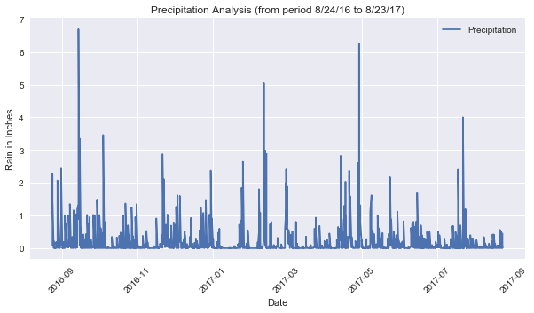
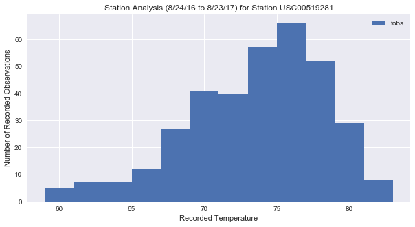
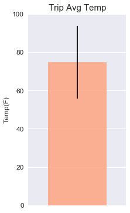

```python
# Import dependencies
import pandas as pd
import numpy as np

import sqlalchemy
from sqlalchemy.ext.automap import automap_base
from sqlalchemy.orm import Session
from sqlalchemy import create_engine, func, inspect, desc
from sqlalchemy import Column, Integer, String, Float, Text, ForeignKey

import datetime as dt
import matplotlib.pyplot as plt
from matplotlib import style

from flask import Flask, jsonify

style.use('seaborn')

```


```python
#create engine and conn
engine = create_engine("sqlite:///hawaii.sqlite")
```


```python
#will get the column names and type using inspect 
inspector = inspect(engine)
inspector.get_table_names()
```


    ['measurements', 'station', 'stations']


```python

# Get a list of column names and types
columns = inspector.get_columns('Measurements')
for c in columns:
    print(c['name'], c["type"])
# columns
```

    id INTEGER
    station TEXT
    date DATE
    prcp FLOAT
    tobs FLOAT
    


```python
engine.execute("select * from measurements limit 5").fetchall()
```


    [(1, 'USC00519397', '2010-01-01', 0.08, 65.0),
     (2, 'USC00519397', '2010-01-02', 0.0, 63.0),
     (3, 'USC00519397', '2010-01-03', 0.0, 74.0),
     (4, 'USC00519397', '2010-01-04', 0.0, 76.0),
     (5, 'USC00519397', '2010-01-07', 0.06, 70.0)]


# Select prcp & date for the last 12 months
results = conn.execute('select * from measurements order by date').first()
results


```python
# Save reference to the tables
#Measurements = Base.classes.measurements
#Stations = Base.classes.stations

# Reflect Database into ORM class
Base = automap_base()
Base.prepare(engine, reflect=True)
Measurements = Base.classes.measurements
```


```python
# Start a session to query the database
session = Session(engine)
```


```python
# Grabs the last date entry in the data table
last_date1 = session.query(Measurements.date).order_by(Measurements.date.desc()).first()
print(last_date1)
```

    (datetime.date(2017, 8, 23),)
    


```python
# to get the last 12 months of data, last date - 365
last_year = dt.date(2017, 8, 23) - dt.timedelta(days=365)
print(last_year)
```

    2016-08-23
    


```python
# query to pull the last year of precipitation data
rain = session.query(Measurements.date, Measurements.prcp).\
    filter(Measurements.date > last_year).\
    order_by(Measurements.date).all()
```


```python
rain_df = pd.DataFrame(rain)
rain_df.head()
```


<div>
<style scoped>
    .dataframe tbody tr th:only-of-type {
        vertical-align: middle;
    }

    .dataframe tbody tr th {
        vertical-align: top;
    }

    .dataframe thead th {
        text-align: right;
    }
</style>
<table border="1" class="dataframe">
  <thead>
    <tr style="text-align: right;">
      <th></th>
      <th>date</th>
      <th>prcp</th>
    </tr>
  </thead>
  <tbody>
    <tr>
      <th>0</th>
      <td>2016-08-24</td>
      <td>0.08</td>
    </tr>
    <tr>
      <th>1</th>
      <td>2016-08-24</td>
      <td>2.15</td>
    </tr>
    <tr>
      <th>2</th>
      <td>2016-08-24</td>
      <td>2.28</td>
    </tr>
    <tr>
      <th>3</th>
      <td>2016-08-24</td>
      <td>1.22</td>
    </tr>
    <tr>
      <th>4</th>
      <td>2016-08-24</td>
      <td>2.15</td>
    </tr>
  </tbody>
</table>
</div>


```python
rain_df.set_index("date").head()
```


<div>
<style scoped>
    .dataframe tbody tr th:only-of-type {
        vertical-align: middle;
    }

    .dataframe tbody tr th {
        vertical-align: top;
    }

    .dataframe thead th {
        text-align: right;
    }
</style>
<table border="1" class="dataframe">
  <thead>
    <tr style="text-align: right;">
      <th></th>
      <th>prcp</th>
    </tr>
    <tr>
      <th>date</th>
      <th></th>
    </tr>
  </thead>
  <tbody>
    <tr>
      <th>2016-08-24</th>
      <td>0.08</td>
    </tr>
    <tr>
      <th>2016-08-24</th>
      <td>2.15</td>
    </tr>
    <tr>
      <th>2016-08-24</th>
      <td>2.28</td>
    </tr>
    <tr>
      <th>2016-08-24</th>
      <td>1.22</td>
    </tr>
    <tr>
      <th>2016-08-24</th>
      <td>2.15</td>
    </tr>
  </tbody>
</table>
</div>


```python

# plot the dataframe

rain_df.plot('date', 'prcp')

plt.xlabel("Date")
plt.ylabel("Rain in Inches")
plt.title("Precipitation Analysis (from period 8/24/16 to 8/23/17)")
plt.legend(["Precipitation"], loc="best")
plt.xticks(rotation=45)

plt.rcParams["figure.figsize"] = [10,5]

plt.savefig('prec.png')
plt.show()
```





```python

# Use Pandas to print the summary statistics for the precipitation data.
rain_df.describe()
```


```python
#Design a query to calculate the total number of stations.
loctions = session.query(Measurements).group_by(Measurements.station).count()
print(" total number of {} stations.".format(loctions))
```

     total number of 9 stations.
    


```python
#Design a query to find the most active stations.
active_st = session.query(Measurements.station, func.count(Measurements.tobs)).group_by(Measurements.station).\
               order_by(func.count(Measurements.tobs).desc()).all()
    
activestation = active_st[0][0]  
print("active Station",activestation,"with",active_st[0][1],"weather observations.\n")
print("Stations in descending order with their number of observations:")
for station, count in active_st:
    print("Station:",station,  "weather observations:", count)
```

    active Station USC00519281 with 2772 weather observations.
    
    Stations in descending order with their number of observations:
    Station: USC00519281 weather observations: 2772
    Station: USC00513117 weather observations: 2696
    Station: USC00519397 weather observations: 2685
    Station: USC00519523 weather observations: 2572
    Station: USC00516128 weather observations: 2484
    Station: USC00514830 weather observations: 1937
    Station: USC00511918 weather observations: 1932
    Station: USC00517948 weather observations: 683
    Station: USC00518838 weather observations: 342
    


```python

# query to pull the last year of precipitation data for the busiest station
temp = session.query(Measurements.station, Measurements.date, Measurements.tobs).\
    filter(Measurements.station == activestation).\
    filter(Measurements.date > last_year).\
    order_by(Measurements.date).all()
```


```python
# plot the temperature data in a histogram with 12 bins
temperature_df=pd.DataFrame(temp)
plt.hist(temperature_df['tobs'],12)
plt.xlabel("Recorded Temperature")
plt.ylabel("Number of Recorded Observations")
plt.title("Station Analysis (8/24/16 to 8/23/17) for Station " + activestation)
plt.legend(["tobs"], loc="best")

plt.savefig("temp.png")
plt.show()
```





```python
# Write a function called `calc_temps` that will accept start date and end date in the format '%Y-%m-%d' 
# and return the minimum, average, and maximum temperatures for that range of dates

def calc_temps(start_date, end_date):
      
    return session.query(func.min(Measurements.tobs), func.avg(Measurements.tobs), func.max(Measurements.tobs)).\
        filter(Measurements.date >= start_date).filter(Measurements.date <= end_date).all()
    

```


```python
#Use the calc_temps function to calculate the min, avg, and max temperatures for your trip using the 
#matching dates from the previous year (i.e. use "2017-01-01" if your trip start date was "2018-01-01")
temp_range = (calc_temps('2012-02-28', '2012-03-05'))

print(temp_range)
```

    [(62.0, 69.3921568627451, 74.0)]
    


```python

# calculate the min/max/avg from last year that matches my trip date
trip_arrive = dt.date(2018, 5, 10)
trip_leave = dt.date(2018, 5, 25)
last_year = dt.timedelta(days=365)
temp_avg_lst_year = (calc_temps((trip_arrive-last_year), (trip_leave-last_year)))
print(temp_avg_lst_year)
print(temp_avg_lst_year[0][0])
print(temp_avg_lst_year[0][1])
print(temp_avg_lst_year[0][2])
```

    [(68.0, 74.82352941176471, 87.0)]
    68.0
    74.82352941176471
    87.0
    


```python
#Temp Analysis

fontsize=12
avgtemp = temp_avg_lst_year[0][1]
min_temp = temp_avg_lst_year[0][0]
max_temp = temp_avg_lst_year[0][2]
err = max_temp - min_temp

# plot min max and average into bar chart, with max-min as the yerr
fig, ax = plt.subplots(figsize=(3,6))
ax.bar(.5,avgtemp,.6,color='lightsalmon',alpha = .8,yerr=err)
ax.grid(axis='x')
ax.set_xlim(0,1)
ax.set_xticks([])
ax.set_ylabel('Temp(F)',fontsize=fontsize)
ax.set_ylim(0,100)
plt.yticks(fontsize=fontsize)
plt.title('Trip Avg Temp',fontsize=fontsize+3)

plt.savefig('trip.png')
plt.show()
```




